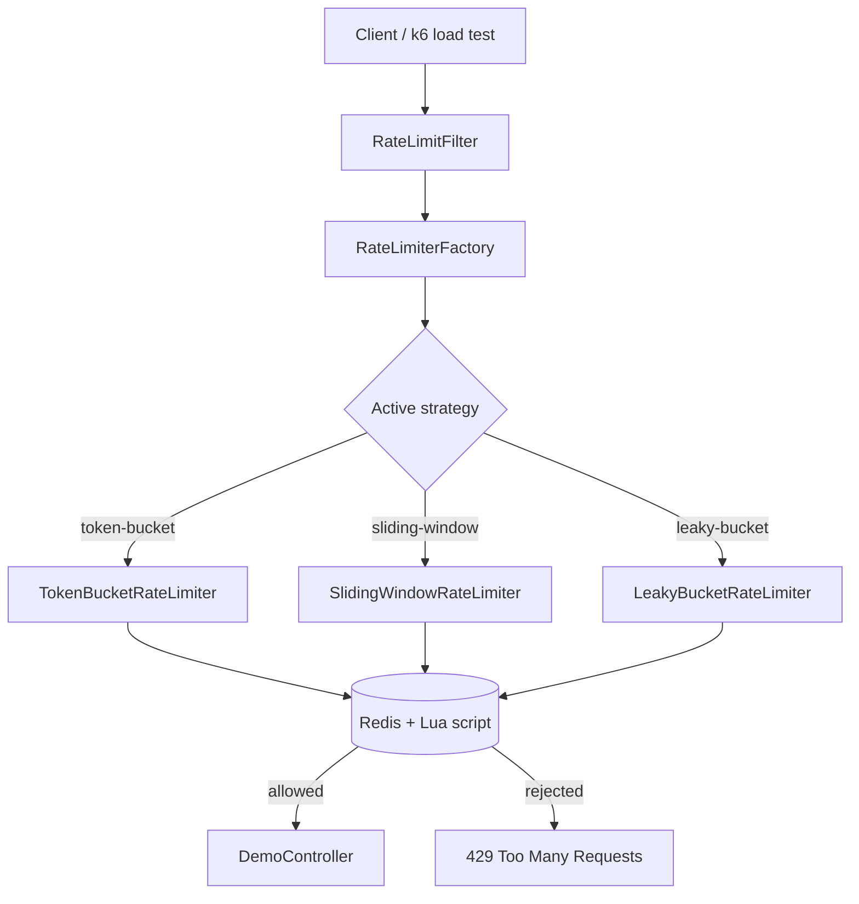
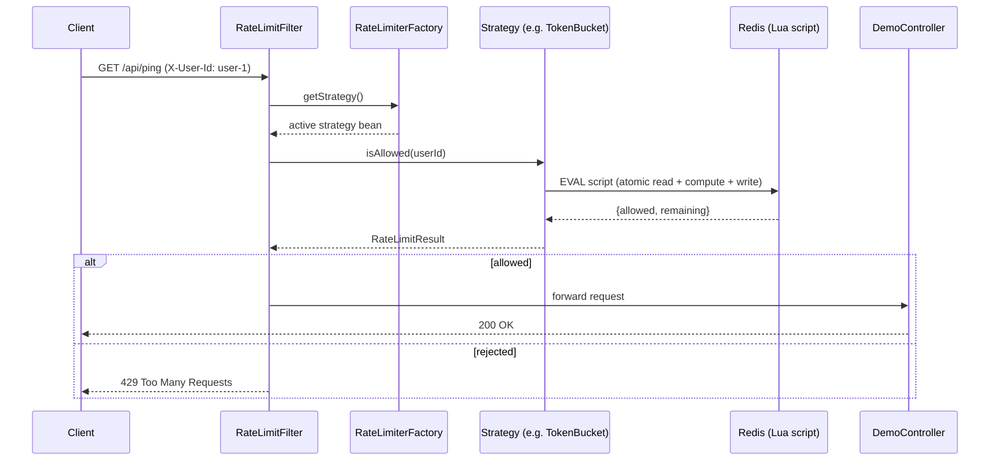

# RateForge

A rate limiter built from scratch — no Bucket4j, no off-the-shelf library. Three classic
algorithms (Token Bucket, Sliding Window, Leaky Bucket), each backed by an atomic Redis Lua
script, swappable through a single config value, and load-tested with k6 so the trade-offs
aren't theoretical.

## Why this exists

Every production API has rate limiting somewhere, and almost everyone who's used one has
never actually built one. I wanted to understand what's really happening underneath — how
you avoid race conditions when two requests from the same user land in the same millisecond,
why some algorithms allow bursts and others don't, and what that actually costs in memory and
through put . So instead of pulling in a library, I implemented the algorithms myself, made them
interchangeable, and benchmarked each one with real traffic patterns.

## What it does

Every incoming request carries an `X-User-Id` header. A servlet filter checks that user's
quota against Redis — atomically, so concurrent requests can never both slip through on the
last token — and either lets the request continue or returns a `429`. Which algorithm runs
underneath is controlled by one line in `application.yml`, with zero code changes needed to
switch.

```bash
curl -i http://localhost:8080/api/ping -H "X-User-Id: user-1"
# HTTP/1.1 200
# X-RateLimit-Remaining: 9
```

---

## System architecture



The filter never knows which concrete algorithm is running — it only talks to the
`RateLimiterStrategy` interface. The factory resolves the active implementation from a config
value at request time. Every algorithm does its read-check-write cycle as a single Lua script
executed inside Redis, so it's impossible for two concurrent requests to both read "one token
left" and both get allowed.

### Request sequence



---

## Tech stack

| Layer | Tech | Why |
|---|---|---|
| Backend | Spring Boot 3.2 (Java 17) | Standard, well-understood production framework |
| Storage | Redis 7 | Single shared source of truth across multiple app instances |
| Atomicity | Redis Lua scripting (`EVAL`) | Read-check-write happens as one uninterruptible step |
| Load testing | k6 | Scriptable, supports steady/burst/ramp traffic patterns |
| Containerization | Docker + Docker Compose | One-command setup, no local Redis install needed |
| Monitoring | Spring Boot Actuator | Health checks and metrics out of the box |

Everything here is free and open-source — no paid services required to run or demo this
project.

---

## Project structure

```
RateForge/
├── pom.xml                          Maven build file — Spring Web, Spring Data Redis, Actuator, Lombok
├── Dockerfile                       Multi-stage build: compiles with Maven, runs on a slim JRE image
├── docker-compose.yml               Spins up Redis and the app together
├── src/
│   ├── main/
│   │   ├── java/com/ratelimiter/
│   │   │   ├── RateLimiterApplication.java     Entry point — boots the Spring context
│   │   │   │
│   │   │   ├── config/
│   │   │   │   ├── RateLimiterProperties.java   Binds the rate-limiter.* block from application.yml
│   │   │   │   └── RedisConfig.java             Builds the RedisTemplate and loads the 3 Lua scripts as beans
│   │   │   │
│   │   │   ├── filter/
│   │   │   │   └── RateLimitFilter.java         Runs before every request, identifies the caller, allows or rejects
│   │   │   │
│   │   │   ├── strategy/
│   │   │   │   ├── RateLimiterStrategy.java       Interface all 3 algorithms implement
│   │   │   │   ├── TokenBucketRateLimiter.java    Allows bursts up to capacity, refills continuously
│   │   │   │   ├── SlidingWindowRateLimiter.java  Most accurate, stores every request timestamp
│   │   │   │   ├── LeakyBucketRateLimiter.java    Smooths bursts into a steady outflow
│   │   │   │   └── RateLimiterFactory.java        Picks the active algorithm from config at request time
│   │   │   │
│   │   │   ├── model/
│   │   │   │   └── RateLimitResult.java           Simple carrier: allowed (boolean) + remaining (long)
│   │   │   │
│   │   │   └── controller/
│   │   │       └── DemoController.java            The actual /api/ping endpoint being protected
│   │   │
│   │   └── resources/
│   │       ├── application.yml                    All config — including which algorithm is active
│   │       └── scripts/
│   │           ├── token_bucket.lua               Atomic token bucket logic, runs inside Redis
│   │           ├── sliding_window.lua             Atomic sliding window logic, runs inside Redis
│   │           └── leaky_bucket.lua               Atomic leaky bucket logic, runs inside Redis
│   │
│   └── test/java/com/ratelimiter/
│       └── RateLimiterApplicationTests.java        Basic Spring context load test
│
└── k6/
    ├── steady-load.js                Constant 5 req/sec for 30s — normal traffic
    ├── burst-load.js                 Flat 50 req/sec for 10s — sudden spike
    └── ramp-load.js                  Gradual 0 → 50 → 0 over 40s — organic growth
```

---

## Getting started

### Prerequisites

- Java 17
- Maven 3.9+
- Docker Desktop
- [k6](https://k6.io/docs/get-started/installation/) (only needed for load testing)

### 1. Start Redis

```bash
git clone <your-repo-url>
cd RateForge
docker compose up redis -d
docker exec -it rateforge-redis redis-cli ping   # expect: PONG
```

### 2. Run the app

```bash
mvn clean install
mvn spring-boot:run
```

App is now live at `http://localhost:8080`.

### 3. Or run everything in Docker

```bash
docker compose up --build
```

---

## Verifying it actually works

A single successful request isn't proof the rate limiter works — anyone can return `200`.
Here's how to actually confirm the logic is correct.

**Health check**
```bash
curl http://localhost:8080/actuator/health
# expect: {"status":"UP", ...}
```

**Exhaust the limit and confirm rejections kick in**
```bash
for i in {1..15}; do
  curl -s -o /dev/null -w "Request $i: %{http_code}\n" \
    http://localhost:8080/api/ping -H "X-User-Id: test-user"
done
# expect: first ~10 return 200, the rest return 429
```

**Confirm different users are isolated**
```bash
curl -i http://localhost:8080/api/ping -H "X-User-Id: brand-new-user"
# expect: 200, even though test-user above is exhausted
```

**Confirm atomicity under real concurrency** — this is the test that actually proves the
Redis Lua script is doing its job:
```bash
seq 1 30 | xargs -P 30 -I {} curl -s -o /dev/null -w "%{http_code}\n" \
  http://localhost:8080/api/ping -H "X-User-Id: concurrent-test" | sort | uniq -c
# expect: exactly `capacity` count of 200s, never more — even with 30 truly parallel requests
```

If that last test ever returns more `200`s than the configured capacity, there's a race
condition and the atomicity guarantee is broken.

---

## Switching algorithms

Edit `src/main/resources/application.yml`:

```yaml
rate-limiter:
  strategy: sliding-window   # token-bucket | sliding-window | leaky-bucket
```

Restart the app. No code changes needed — the `RateLimiterFactory` resolves the new strategy
from the same `Map<String, RateLimiterStrategy>` that Spring built at startup.

---

## Load testing

```bash
k6 run k6/steady-load.js   # normal traffic
k6 run k6/burst-load.js    # sudden spike
k6 run k6/ramp-load.js     # gradual growth
```

Run all three against each algorithm and compare `http_req_failed` (rejection rate) and
`http_req_duration` (latency) to see the actual trade-offs play out, rather than just reading
about them.

---

## Design notes

**Why Lua scripts instead of separate Redis calls?** Every algorithm needs a
"read state → compute → write state" sequence. Done as separate `GET`/`SET` calls, two
concurrent requests could both read the same "1 token left" state before either writes back —
both get allowed, and the limit is silently violated. A Lua script runs the whole sequence as
one atomic step on the Redis server, closing that race condition entirely.

**Why a filter instead of logic inside each controller?** The rate limiter has nothing to do
with what `/api/ping` (or any future endpoint) actually does. Putting it in a servlet filter
means every endpoint is protected automatically, and the business logic in `DemoController`
stays completely unaware that rate limiting exists.

**Why a Map<String, RateLimiterStrategy> instead of an if/else chain?** Spring auto-populates
the map with every bean implementing the interface, keyed by bean name. Adding a fourth
algorithm later means writing one new class — no existing code needs to change.

---

## Possible extensions

- Per-endpoint limits instead of one global limit per user
- A fail-open/fail-closed strategy for when Redis itself is unreachable
- A Grafana dashboard on top of the exposed Actuator metrics
- Distributed rate limiting across multiple data centers using Redis Cluster
